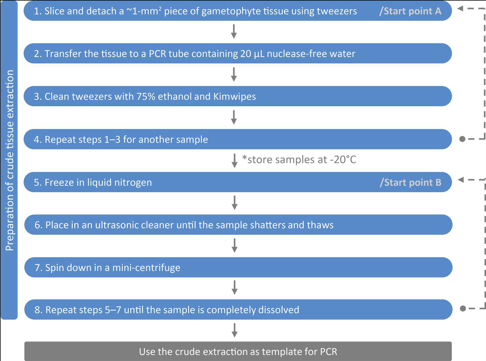

```{r setup, include=FALSE}
options(htmltools.dir.version = FALSE)
knitr::opts_chunk$set(
  fig.width = 9, fig.height = 3.5, fig.retina = 3,
  out.width = "100%",
  cache = FALSE,
  echo = TRUE,
  message = FALSE, 
  warning = FALSE,
  hiline = TRUE
)

# Set up references
library(RefManageR)
library(bibtex)
library(rmdref)
BibOptions(
  check.entries = FALSE, 
  bib.style = "authoryear", 
  cite.style = "authoryear", 
  style = "markdown",
  max.names = 2,
  hyperlink = FALSE, 
  longnamesfirst = FALSE,
  dashed = FALSE)

```

```{r load-full-refs, include = FALSE, warning = FALSE, cache = TRUE}
# Read in full reference library
refs_other <- ReadBib("refs_other.bib")
main_library <- ReadBib("main_library.bib", check = FALSE)
refs_all <- c(main_library, refs_other)
```

```{r filter-refs, include = FALSE, warning = FALSE}
# Filter to only needed references
filter_refs_bib(
  "gameto_barcoding.Rmd", bib_in = refs_all, bib_out = "references.bib")
```

```{r load-bib, include = FALSE, warning = FALSE}
# Load filtered references
bib <- ReadBib("references.bib")
```

```{r xaringan-themer, include = FALSE, warning = FALSE}
library(xaringanthemer)
style_duo_accent(
  primary_color = "#1381B0",
  secondary_color = "#FF961C",
  inverse_header_color = "#FFFFFF",
  text_font_size = "1.2rem",
  extra_css = list(
    ".small" = list("font-size" = "90%"),
    ".xxl" = list("font-size" = "400%")
  )
)
```

## Preprint

#### Nitta and Chambers 2022 *Apps. in Plant Sci.* (in press)<br>https://ecoevorxiv.org/dr25p/

## Slides

#### https://joelnitta.github.io/gameto_barcode_ifs

---
class: center, middle

## Goal: Provide a practival overview of<br>DNA barcoding in fern gametophytes

---

class: inverse, center, middle

# What is DNA barcoding?

---

## What is DNA barcoding?

.pull-left[
Use of one\* DNA locus for identifying species `r cite_p(c("@Hebert2003", "@Hebert2003a"))`
]
<!-- [@Hebert2003; @Hebert2003a] -->

.pull-right[

<br>.small[`r cite_t("@Li2021a")`]
]

---

## What is DNA barcoding?

.pull-left[
Use of one\* DNA locus for identifying species `r cite_p(c("@Hebert2003", "@Hebert2003a"))`

- __"Barcode" is a misnomer__
  - No locus is identical across all individuals of a species and different between different species
  
- Mitochondrial *COI* is used in animals

- \*No single marker available in plants
]

.pull-right[
 .xxl[≠] 
]

---

## Why barcode fern gametophytes?

.pull-left[
Identify __field-collected gametophytes__
]

.center[]

---

## Why barcode fern gametophytes?

.pull-left[

> "In combination these aspects of __prothallial morphology serve to characterize most of the larger groups of homosporous ferns__, nearly as clearly as sporophyte morphology"

Gametophyte morphology is important for systematics, but __cannot be relied on to consistently identify species__

.footnote[`r cite_t("@Nayar1971")`]

]

.pull-right[
.center[

]
]

---

## Why barcode fern gametophytes?

.pull-left[
A, B: __Cordate__ (many terrestrial species)  

C, D: __Ribbon__ (e.g., Vittariaceae, Hymenophyllaceae)  

E, F: __Filamentous__  (e.g., Schizaeaceae, Hymenophyllaceae) 
]


---

## Why barcode fern gametophytes?

.pull-left[
__Cordate__  
A: *Sphaeropteris medullaris* (G. Forst.) Bernh.  
B: *Austroblechnum raiateense* (J.W.Moore) Gasper
& V.A.O.Dittrich

__Ribbon__  
C: *Callistopteris apiifolia* (C. Presl) Copel.  
D: *Hymenophyllum polyanthos* (Sw.) Sw.

__Filamentous__  
E: *Crepidomanes minutum* (Blume) K.Iwats.  
F: *Abrodictyum dentatum*(Bosch) Ebihara & K.Iwats.
]


---

## The beginning: ID of a single gametophyte

.pull-left[
- First use of DNA barcodes in ferns
- Sequence *rbcL* from gametophyte in culture, query GenBank
- Identification as *Osmunda*

.footnote[`r cite_t("@Schneider2006a")`]
]

.pull-right[
.center[


.small[`r cite_t("@Soare2008")`]
]
]

---

## Typical approach

.center[

]

---

## Choosing a marker

### My recommendation: *rbcL* + *trnL-trnF*

- Nuclear markers are too difficult to obtain (multiple copies)
- *rbcL* can differentiate between species in most cases, has best coverage on GenBank
- *trnL-F* can be used as secondary marker for closely related taxa

| Marker | Type | PCR success | Variability |
| ------ | ---- | ----------- | ----------- |
| __*rbcL(-a)*__ | Coding | High | Low |
| *matK* | Coding | Low | Moderate to high
| *trnH-psbA* | Spacer | High | High in some groups, low in others
| __*trnL-F*__ | Spacer | High | High

---
class: inverse, center, middle

# Building the library

---

## Building the library

Sanger sequencing of (at least) one specimen per species in study area from sporophytes

---

## Building the library

Sanger sequencing of (at least) one specimen per species in study area from sporophytes

.pull-left[

What about __multiple individuals per species?__
- Needed to assess __"barcode gap"__
- For __*rbcL*__, almost certain to be __zero variation__

]

.pull-right[
.center[]
.small[`r cite_t("@Meyer2005")`]
]

---

## Building the library

Sanger sequencing of (at least) one specimen per species in study area from sporophytes

.pull-left[

What about __multiple individuals per species?__
- Needed to assess __"barcode gap"__
- For __*rbcL*__, almost certain to be __zero variation__

__My recommendation:__
- __One specimen/species for most taxa__
- Multiple specimens in case of "difficult" taxa (species complexes)
]

.pull-right[
.center[]
.small[`r cite_t("@Meyer2005")`]
]

---
## Case study 1:<br>Pteridophytes of Japan

.pull-left[
- *rbcL* + *trnH-psbA*

- 733 taxa, 1 individual per species

- High success in sexual diploids, lower in polyploid or apogamous taxa

.footnote[`r cite_t("@Ebihara2010")`]

]


---

## Case study 2: Ferns of Moorea and Tahiti, French Polynesia

.pull-left[
- *rbcL* + *trnH-psbA*

- 145 spp., 1 individual per species for most

- High success rate overall (better than Japan)

.footnote[`r cite_t("@Nitta2017")`]
]

.pull-right[
.center[]
]

---
class: inverse, center, middle

# Using the barcode

---

## Case study 1: Independent gametophytes in Japan

.pull-left[
- __Focus on gametophyte mats__
- *Hymenophyllum mikawanum*: sporophyte endangered
- *Haplopteris mediosora*: sporophyte extremely rare
- *Antrophyum plantagineum*: sporophyte unknown in Japan
  
.footnote[`r cite_t("@Murakami2021")`]
]

.pull-right[
.center[]
.center[]
]

---

## Case study 2: Gametophyte community surveys in Japan

.pull-left[
- First use of __garden net__ for sampling
- Non-cordate gametophytes tend to occur separate from sporophytes
- Identify several new independent gametophytes

.footnote[`r cite_t("@Ebihara2013")`]
]

.pull-right[
.center[]
]

---

## Case study 2: Gametophyte community surveys in Japan

.pull-left[
- First use of __garden net__ for sampling
- Non-cordate gametophytes tend to occur separate from sporophytes
- Identify several new independent gametophytes

.footnote[`r cite_t("@Ebihara2013")`]
]

.pull-right[
.center[


]
]

---

## Case study 3: Community structure of ferns in Tahiti

.pull-left[
- __96-well plates for DNA extraction, PCR__
- Sporophytes are more affected by environment
- Gametophytes are widely distributed, but observed fewer than expected

.footnote[`r cite_t("@Nitta2017")`]
]

.pull-right[
.center[]
]

---

## Case study 3: Community structure of ferns in Tahiti

.pull-left[
- 96-well plates for DNA extraction, PCR
- __Sporophytes are more affected by environment__
- Gametophytes are widely distributed, but observed fewer than expected

.footnote[`r cite_t("@Nitta2017")`]
]


---
class: inverse, center, middle

# The future: Next-generation DNA sequencing

---

## Disadvantages of Sanger sequencing

- Slow
- Limited number of samples
- Limited number of loci

High-throughput methods could allow for **continuous monitoring over time and space** of gametophyte populations

---

## Next-Gen DNA sequencing: Microfluidic PCR

.pull-left[
- Allows to __massively scale-up sequencing__
- Expensive

.footnote[`r cite_t("@Gostel2020")`]
]


---

## Next-Gen DNA sequencing: MinION

.pull-left[
- Portable DNA sequencer
- Long reads (ca. 1,000 bp)
- Enables __identification of species<br>in the field__

.footnote[`r cite_t("@Pomerantz2018")`]
]


---

## Tissue-direct PCR

.pull-left[
- __Skips DNA extraction step__
- Used to survey *Lomariopsis* in Taiwan
- Possible to combine with next-gen sequencing?

.footnote[`r cite_t("@Li2009")`]
]



---

## Tissue-direct PCR

.pull-left[
- Skips DNA extraction step
- __Used to survey *Lomariopsis* in Taiwan__
- Possible to combine with next-gen sequencing?

.footnote[`r cite_t("@Li2009")`]
]


---

## Conclusions

- DNA barcoding can provide unprecedented insights into fern biology
- Sanger sequencing is (still) useful, but limited
- Next-generation DNA barcoding has the potential to revolutionize fern biology (again)

.center[]

---

## Acknowledgements

- Co-author Sally Chambers
- Marie Selby Botanical Garden
- Li-Yaung Kuo

---

## References

.small[
```{r refs-1, results = "asis", echo = FALSE}
PrintBibliography(bib, start = 1, end = 4)
```
]

---

.small[
```{r refs-2, results = "asis", echo = FALSE}
PrintBibliography(bib, start = 5, end = 9)
```
]

---

.small[
```{r refs-3, results = "asis", echo = FALSE}
PrintBibliography(bib, start = 10, end = length(bib))
```
]
